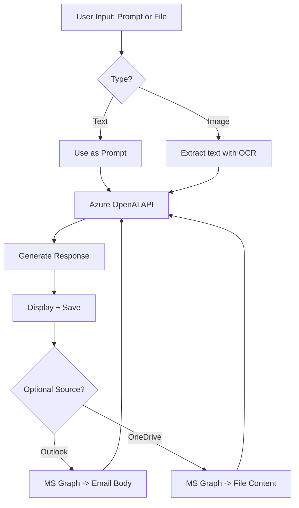

# 🤖 Azure Generative AI Copilot

This project demonstrates a complete integration of Azure OpenAI with a custom Python interface (CLI and Web), OCR for image processing, and Microsoft Graph API for interacting with Outlook and OneDrive. It showcases the capabilities of Generative AI and Copilot-style automation in real-world scenarios.

---

## 🎯 Features

✅ Use text prompts or file uploads  
✅ Support for image files with OCR (pytesseract)  
✅ Web Interface built with Streamlit  
✅ Command-line Interface (Typer)  
✅ Integration with Microsoft Graph API  
✅ Read emails from Outlook and files from OneDrive  
✅ Save generated output locally  
✅ Secure credential management with `.env` and MSAL

---

## 🧱 Project Structure

```
azure-generative-ai-copilot/
├── app/
│   ├── __init__.py
│   ├── main.py             # CLI
│   ├── api.py              # Azure OpenAI handler
│   ├── processor.py        # File/text/image processing
│   ├── ocr.py              # OCR support
│   ├── graph.py            # MS Graph (Outlook, OneDrive)
│   └── web_ui.py           # Web interface (Streamlit)
├── inputs/                 # User-provided inputs
├── outputs/                # AI-generated outputs
├── .env                    # API keys (not committed)
├── requirements.txt
├── README.md
└── LICENSE
```

---

## ⚙️ Setup Instructions

### 1. Clone the repository

```bash
git clone https://github.com/your-username/azure-generative-ai-copilot.git
cd azure-generative-ai-copilot
```

### 2. Create and activate virtual environment

```bash
python -m venv venv
source venv/bin/activate  # Windows: venv\Scripts\activate
```

### 3. Install dependencies

```bash
pip install -r requirements.txt
```

---

## 🔐 Configuration

### Create `.env` file

```env
# Azure OpenAI
AZURE_OPENAI_API_KEY=your-azure-key
AZURE_OPENAI_ENDPOINT=https://your-resource-name.openai.azure.com/
AZURE_OPENAI_DEPLOYMENT_NAME=gpt-4
AZURE_OPENAI_API_VERSION=2023-12-01-preview

# Microsoft Graph
CLIENT_ID=your-app-client-id
TENANT_ID=common
```

---

## 💻 Web Interface

```bash
streamlit run app/web_ui.py

```

You can:
- Type a prompt
- Upload `.txt`, `.png`, `.jpg` files
- View and download results

---

## 🖥 CLI Interface

```bash
# Process one file
python -m app.main process inputs/ideas.txt

# Process all files in inputs/
python -m app.main batch

# Read emails from Outlook
python -m app.main read-emails

# Read files from OneDrive
python -m app.main read-onedrive
```

---

## 📤 Input/Output Examples

Place files in the `inputs/` directory or upload via web.

Output files are saved in `outputs/`, named as `<input_name>_response.txt`.

---

## 🧠 Technologies Used

- Azure OpenAI Service (GPT-4)
- Microsoft Graph API
- OCR with Tesseract
- Streamlit (UI)
- Typer (CLI)
- MSAL (Graph Auth)

---

## 🧭 Architecture Diagram



---

## 📎 License

MIT License

---

## 📚 References

- [Azure OpenAI](https://learn.microsoft.com/en-us/azure/cognitive-services/openai/)
- [Microsoft Graph](https://learn.microsoft.com/en-us/graph/)
- [MSAL Python](https://pypi.org/project/msal/)
- [Streamlit](https://streamlit.io/)
```

---
